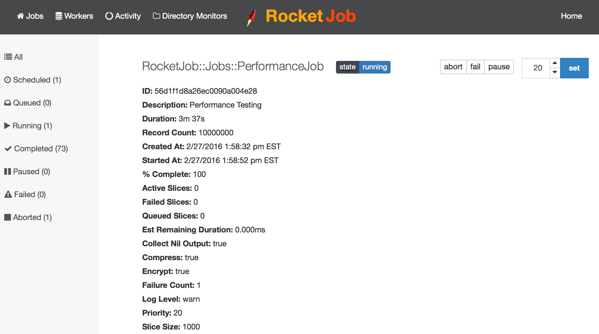
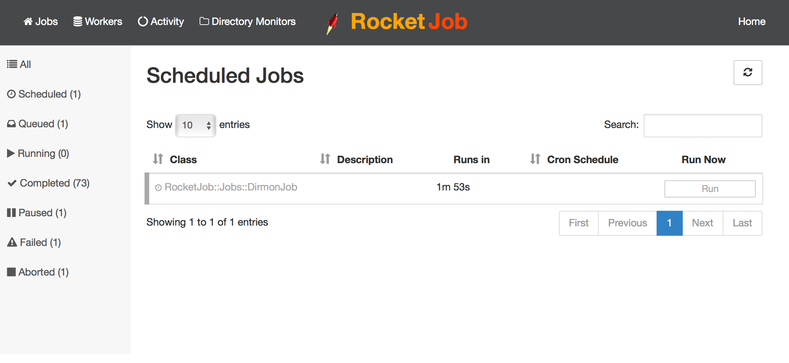
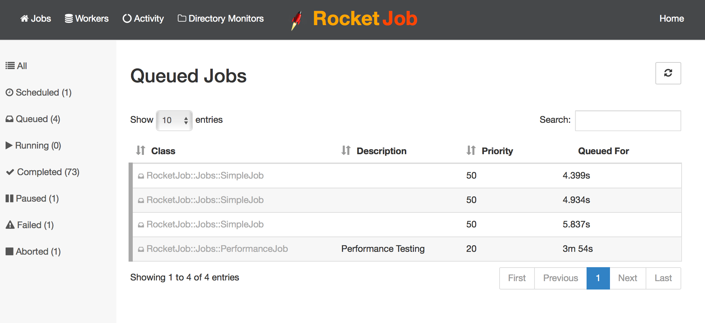
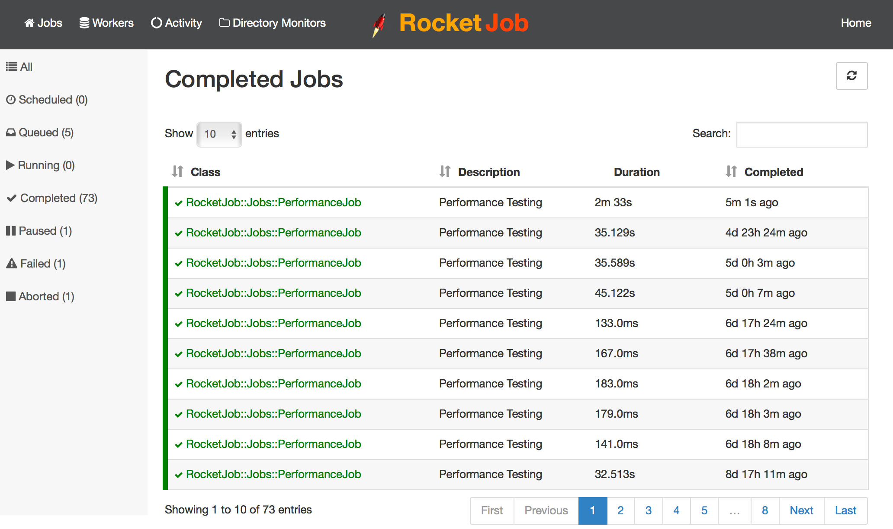
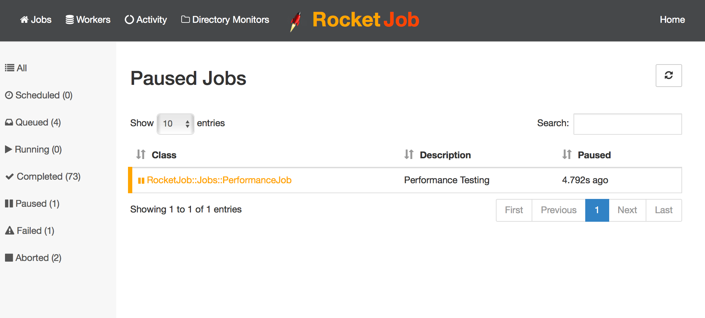
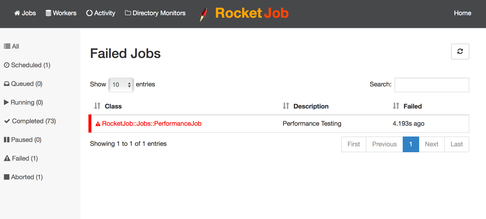
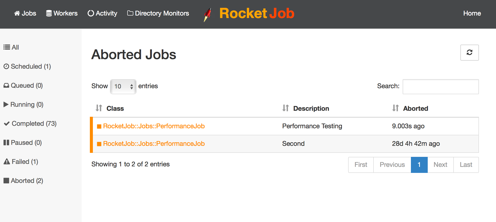
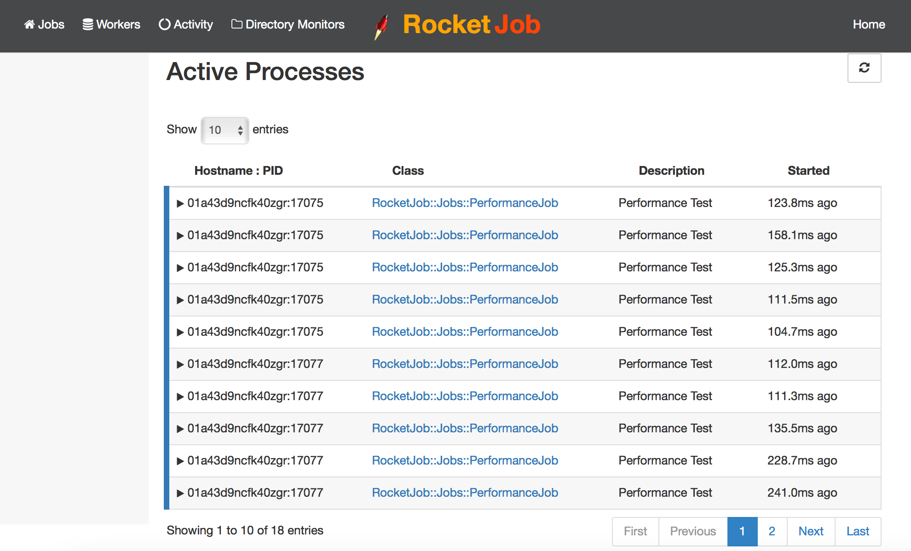

## Rocket Job Mission Control

[Rocket Job Mission Control][1] is the web interface for managing and monitoring [Rocket Job][0].

[Rocket Job Mission Control][1] first opens with the list of running jobs in the system, listed in reverse chronological order.
I.e. With the newest job at the top.

Each job entry in the list includes:

* The class name of the job
* An icon indicating the state of the job
* A duration indicating:
    * For completed jobs: How long the job took to run.
    * For queued jobs: How long the job has been queued for.
    * For running jobs: How long the jobs has been processing.
    * For aborted or failed jobs: How long the job had been processing until it was failed or aborted.
* For running jobs, it also includes a progress bar indicating the percent complete.

### Features

* View all queued, running, failed, and running jobs
* View all completed jobs where `destroy_on_complete == false`
* Pause any running jobs
* Resume paused jobs
* Retry failed jobs
* Abort, or fail queued or running jobs
* Destroy a completed or aborted job
* By separating [Rocket Job Mission Control][1] into a separate gem means it does not
  have to be loaded everywhere [Rocket Job][0] jobs are defined or run.

### Managing Jobs

Select a job in [Rocket Job Mission Control][1] to see more details about the status of that job:

Based on the state of the job, the relevant actions will appear:

* `retry`
    * When a job has failed, it can be resumed / retried by hitting the `retry` button.
* `pause`
    * Pause a `running` or `queued` job to temporarily stop processing on the job.
    * The job will only continue processing once the `resume` button is hit.
    * Note: `pause` and `resume` is intended for jobs that include `RocketJob::Plugins::BatchJob` since
      those jobs can be pre-empted during processing. Otherwise, the job needs to manually perform
      checks to see if the job is paused and halt processing.
* `resume`
    * Resume a `paused` job so that it can continue processing again.
* `fail`
    * Fail a `running` or `queued` job so that no more processing will occur.
    * All input & output collections will be cleaned up for jobs that include `RocketJob::Plugins::BatchJob`.
    * The job can be retried later after it has failed.
* `abort`
    * Abort a `running` or `queued` job so that no more processing will occur.
    * All input & output collections will be cleaned up for jobs that include `RocketJob::Plugins::BatchJob`.
    * The job _cannot_ be retried after it has been aborted.
* `destroy`
    * Destroy the job entirely from the system.

For example for a failed job:

#### Scheduled Jobs

Scheduled jobs are jobs scheduled to be run in the future and include jobs that repeat such as Cron Jobs.

To run a job immediately instead of waiting until its next scheduled time, select the `Run` button.

#### Queued Jobs

#### Running Jobs

#### Completed Jobs

#### Paused Jobs

#### Failed Jobs

#### Aborted Jobs

### Job Activity by Worker

To see what each worker is currently busy with select the `Activity` menu option:

### Managing Workers

To manage workers, select the `Workers` menu option:

Each worker can be managed individually, or to pause all current work, select `Pause All`.

The workers can be resumed later by selecting `Resume All`.

To shutdown all workers via [Rocket Job Mission Control][1], click on `Actions` and select `Stop All`.

### [Next: Installation ==>](installation.html)

[0]: http://rocketjob.io
[1]: https://github.com/rocketjob/rocketjob_mission_control
